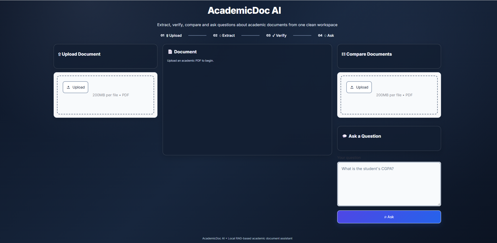
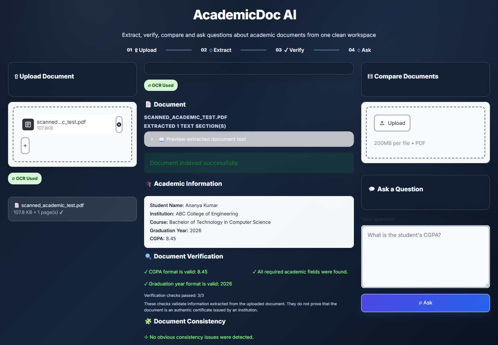
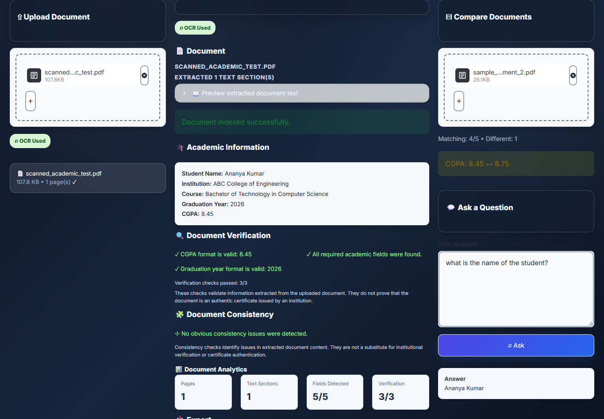
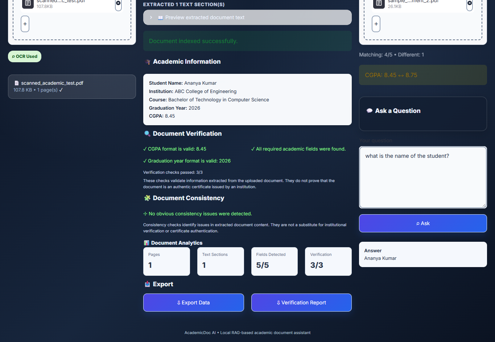

# 📄 AcademicDoc AI

AcademicDoc AI is an academic document verification and knowledge assistant that extracts information from academic PDFs, validates key fields, compares documents, and answers questions using the extracted document content.

## ✨ Features

- 📤 **PDF Upload**  
  Upload academic PDF documents for analysis.

- 🔍 **Text Extraction & OCR**  
  Extracts text from digital PDFs and uses OCR when readable text is unavailable.

- 🎓 **Academic Information Extraction**  
  Detects:
  - Student name
  - Institution
  - Course
  - Graduation year
  - CGPA

- ✅ **Document Verification**  
  Checks whether required academic fields are present and validates CGPA and graduation-year formats.

- 🧩 **Consistency Checking**  
  Identifies missing fields, invalid values, and obvious inconsistencies in extracted information.

- 📊 **Document Analytics**  
  Displays pages, text sections, detected fields, and verification results.

- 🔄 **Document Comparison**  
  Compares two academic PDFs and highlights differences in extracted fields.

- 💬 **Question Answering**  
  Ask questions about the uploaded document and receive answers based on its extracted content.

- 📥 **Report & Data Export**  
  Provides extracted-data and verification-report export options.

## 🛠️ Technologies

- Python
- Streamlit
- PyMuPDF
- Tesseract OCR
- OCR/document processing
- Local RAG-based document question answering

## 📁 Project Structure

```text
AcademicDoc-AI/
│
├── app.py
├── vector_store.py
├── test.py
├── .gitignore
├── requirements.txt
│
├── Screenshots/
│   ├── upload.png
│   ├── ocr-extraction.png
│   ├── comparison-qa..png
│   └── results.png
│
└── data/
    ├── sample_academic_document.pdf
    ├── sample_academic_document_2.pdf
    └── scanned_academic_test.pdf
```

## 🖥️ Application Screenshots

### 1. Upload & Document Workspace



### 2. OCR & Academic Information Extraction



### 3. Document Comparison & Question Answering



### 4. Verification, Analytics & Export



## ⚙️ How It Works

1. Upload an academic PDF.
2. Extract text from the document.
3. Apply OCR when required for scanned documents.
4. Identify key academic information.
5. Perform verification and consistency checks.
6. Compare academic documents when a second document is provided.
7. Ask questions about the uploaded document.
8. Export extracted data or a verification report.

## ⚠️ Note

The verification features validate information extracted from the uploaded document. They do not establish that a document is an authentic certificate issued by an institution.

## 📌 Project Purpose

AcademicDoc AI demonstrates how document processing, OCR, information extraction, verification checks, document comparison, and local retrieval-based question answering can be combined into a single academic document assistant.
